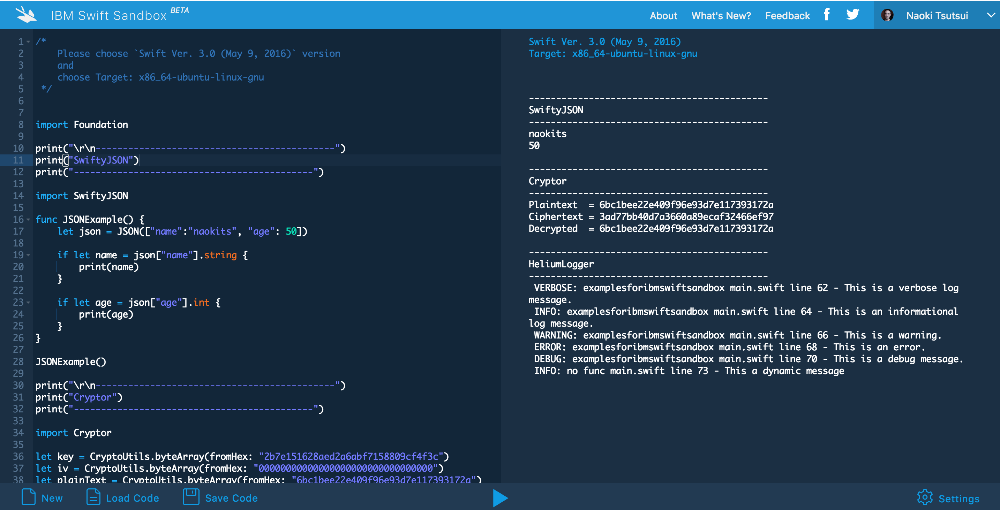

# examples-for-ibm-swift-sandbox

Example code and package settings for `IBM Swift Sandbox` using 3’d party packages like `SwiftyJson`.



## Demo
Access the following link and then execute it.

https://swiftlang.ng.bluemix.net/#/repl?gitPackage=https:%2F%2Fgithub.com%2Fnaokits%2Fexamples-for-ibm-swift-sandbox.git&swiftVersion=swift-DEVELOPMENT-2016-05-09-a-ubuntu15.10

Note: Do not change value of `gitPackage` and `swiftVersion` parameters.

## Hints

A simple code and settings that shows how to use 3'd party packages.

Sources/main.swift
```swift
import Foundation
import SwiftyJSON

func JSONExample() {
    let json = JSON(["name":"naokits", "age": 50])

    if let name = json["name"].string {
        print(name)
    }

    if let age = json["age"].int {
        print(age)
    }
}

...
```

.swift-version
```
DEVELOPMENT-SNAPSHOT-2016-05-09-a
```

packages.swift
```swift
import PackageDescription

let package = Package(
    name: "examples-for-ibm-swift-sandbox",
    dependencies: [
        .Package(url: "https://github.com/IBM-Swift/SwiftyJSON.git", majorVersion: 8),
        .Package(url: "https://github.com/IBM-Swift/BlueCryptor.git", majorVersion: 0, minor: 2),
        .Package(url: "https://github.com/IBM-Swift/HeliumLogger.git", majorVersion: 0, minor: 9),
    ]
)
```


### importants

In this case, latest version of each packages works with the `DEVELOPMENT-SNAPSHOT-2016-05-09-a` version of the Swift binaries. Compatibility with other Swift versions is not guaranteed.


## Referenced links

- [Swift.org - Download Swift](https://swift.org/download/#using-downloads)
- [Swift.org - Package Manager](https://swift.org/package-manager/#example-usage)
- [SwiftyJSON | IBM Swift Package Catalog](https://swiftpkgs.ng.bluemix.net/package/IBM-Swift/SwiftyJSON?cm_mc_uid=00257843404014521352087&cm_mc_sid_50200000=1466362846)
- [HeliumLogger | IBM Swift Package Catalog](https://swiftpkgs.ng.bluemix.net/package/IBM-Swift/HeliumLogger?cm_mc_uid=00257843404014521352087&cm_mc_sid_50200000=1466362846)
- [BlueCryptor | IBM Swift Package Catalog](https://swiftpkgs.ng.bluemix.net/package/IBM-Swift/BlueCryptor?cm_mc_uid=00257843404014521352087&cm_mc_sid_50200000=1466376370)

### See also

- [IBM-Swift/SwiftyJSON-Sample: Learn to use SwiftyJSON](https://github.com/IBM-Swift/SwiftyJSON-Sample)
- [IBM-Swift/BlueCryptor-Sample: Learn to use BlueCryptor](https://github.com/IBM-Swift/BlueCryptor-Sample)
- [IBM-Swift/HeliumLogger-Sample: Learn to use HeliumLogger](https://github.com/IBM-Swift/HeliumLogger-Sample)
